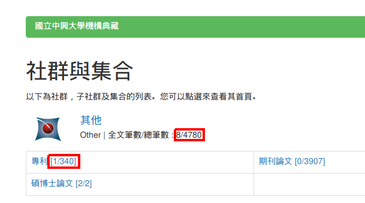
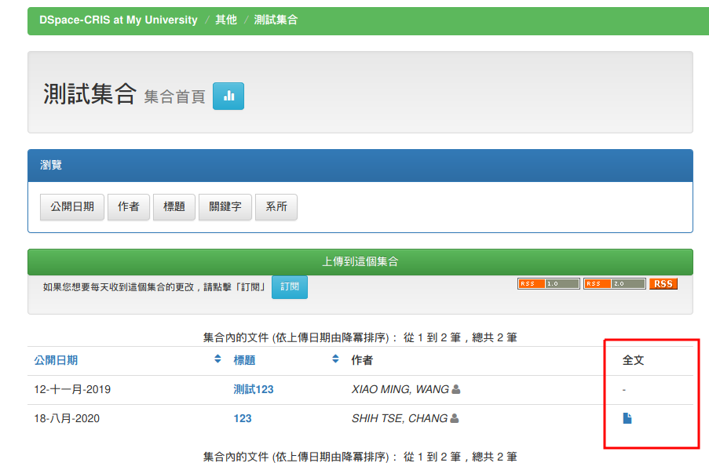
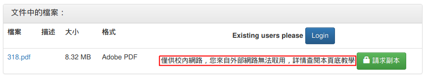

# DSpace CRIS 中興大學自製版

(forked from [Cineca/DSpace](https://github.com/Cineca/DSpace))

由 中興大學校史館組 張世澤<[zhshize@smail.nchu.edu.tw](mailto:zhshize@smail.nchu.edu.tw)> 開發/維護。

## 安裝

請服用[官方文件#Installation](https://wiki.lyrasis.org/display/DSPACECRIS/Installation)

## 設定
### OAI Index
請記得設定OAI 2.0的索引： [官方文件#OAI 2.0](https://wiki.lyrasis.org/display/DSDOC5x/OAI+2.0+Server)
建議以crontab每天執行一次

### Solr statistics
[官方文件#SOLR Statistics](https://wiki.lyrasis.org/display/DSDOC5x/SOLR+Statistics)

GeoLite已有新版本GeoLite2，在```[dspace-source]/config/modules/usage-statistics.cfg```
中已設定GeoLite2-City資料庫存放位置為```/usr/share/GeoIP/GeoLite2-City.mmdb```，若安裝時沒有自動生成，
請到 [MaxMind](https://dev.maxmind.com/geoip/geoip2/geolite2) 下載。

## 客製化功能說明

### 修改社群列表(community-list)界面及加入全文統計功能
[d7c699d](https://github.com/NCHUIR/DSpace/commit/d7c699dd2f96cc44bef4834af263db538d535c9e)



其中紅色框的部分爲*全文統計功能*，由舊版(
[commit](https://github.com/NCHUIR/DSpace/commit/03dd53c102a68e60ea71528039c624d3b9e4b48e)
)遷移修改而來。

### 在文件列表加入全文下載圖示
[a01b9e7](https://github.com/NCHUIR/DSpace/commit/a01b9e7f17ae5907e62dc1df390d18f9a6bf8a98), 
[c2dbf7a](https://github.com/NCHUIR/DSpace/commit/c2dbf7a5a8a815b5364e9f366aa67a3b705c72d8)



其中紅色框的部分爲*全文下載圖示功能*，如果沒有全文可供下載，將顯示"-"代表無法下載。

### 在文件下載僅限內網/隱藏文件時顯示提示訊息
[82af9f4](https://github.com/NCHUIR/DSpace/commit/82af9f41c01df0ab893ca902c6e59a22ac03d59b) (開啓內網IP權限設定), 
[b772218](https://github.com/NCHUIR/DSpace/commit/b772218b050d9696814c74bcb9d8930b5fc2be65), 
[212ff08](https://github.com/NCHUIR/DSpace/commit/212ff08ac21504f0edd88231234e67bb380e1c45)



其中紅色框的部分爲*內網下載提示訊息*，如果目前使用者沒有權限、
全文權限包含群組**InternalNetwork**的READ權限且使用者的IP不在名單中
([authentication-ip.cfg](config/modules/authentication-ip.cfg))
則顯示內網下載提示訊息。